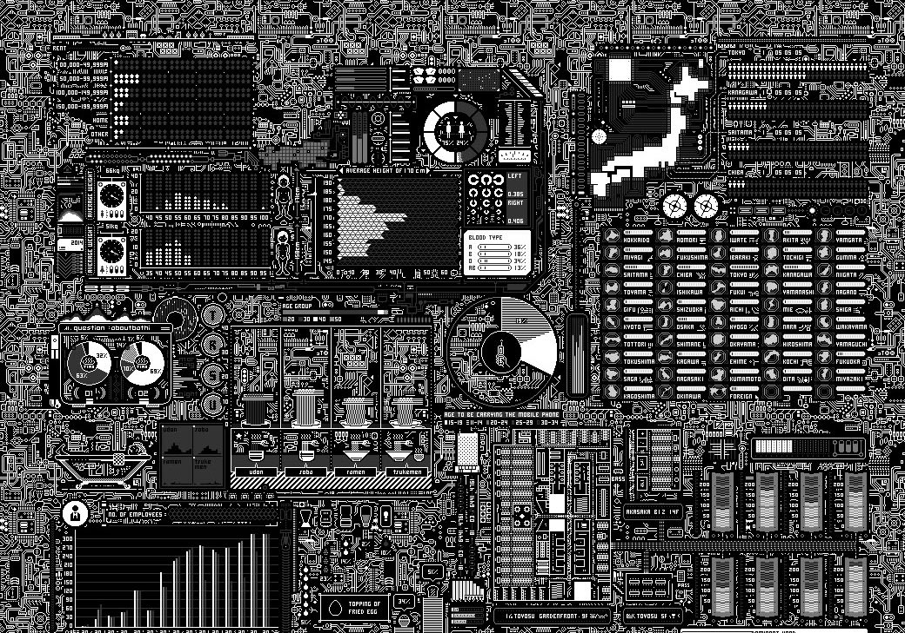

<div align="center">

<!-- Upload circuit-board.jpg to your repo and update this path -->


```
╔══════════════════════════════════════════════════════════════════╗
║                                                                  ║
║              S U N G - Y U   L I N  ·  SungYu444                 ║
║                                                                  ║
║         CS Student  ·  Cybersecurity  ·  Systems                 ║
║                                                                  ║
╚══════════════════════════════════════════════════════════════════╝
```

[](https://github.com/SungYu444)
[](https://github.com/SungYu444)
[](https://github.com/SungYu444/Arch-dotfiles)

</div>

---

## `$ whoami`

```
  name     :: Sung-Yu Lin
  alias    :: SungYu444
  role     :: Computer Science Student
  focus    :: Cybersecurity & Systems Programming
  os       :: Arch Linux  //  wm :: Hyprland
  status   :: [ LEARNING ] [ BUILDING ] [ EXPLORING ]
```

> CS student with a focus on **cybersecurity** and systems programming. I like understanding how things work at a deep level — how they're built, how they break, and how to make them harder to attack. Building things that range from 3D space visualizations to ESP32 network scanners to AI-powered dev tools.

---

## `▸ ~/skills`

**Security & Systems**


**Languages**


**Tools & Frameworks**


---

## `◈ ~/projects`

| Project | Description | Stack |
|---------|-------------|-------|
| [**NASA-SPACE-APP**](https://github.com/SungYu444/NASA-space-app-6js) | Interactive 3D meteor impact & asteroid visualization | `TypeScript` `React Three Fiber` `WebGL` |
| [**ESP32-WIFI-SECURITY**](https://github.com/SungYu444/ESP32-home-WIFI-security) | Network scanner using ARP requests to map local devices | `C` `ESP32` `Networking` |
| [**GITMERGER**](https://github.com/SungYu444/GitMerger) | AI-powered GitHub merge conflict resolution tool | `TypeScript` `AI` |
| [**STRUDEL-SONG**](https://github.com/SungYu444/Strudel-song) | Music created with live coding | `JavaScript` |
| [**ARCH-DOTFILES**](https://github.com/SungYu444/Arch-dotfiles) | Hyprland configuration for Arch Linux | `Shell` |

---

## `◉ ~/stats`

<div align="center">


</div>

---

## `⟩ ~/interests.py`

```python
# current_state.py — last updated 2026

interests = {
    "security":   ["network scanning", "vulnerability research", "embedded security"],
    "systems":    ["arch linux", "low-level programming", "hardware hacking"],
    "building":   ["3D visualizations", "AI-powered tools", "IoT devices"],
    "currently":  ["deepening CTF skills", "exploring reverse engineering"]
}

print(f"Always building. Always learning.")
```

---

<div align="center">

`[ Let's connect & build something interesting ]`

[](https://www.linkedin.com/in/sung-yu-lin-a29072316/)
[](mailto:sungyu444@gmail.com)

<sub>◈ ◈ ◈ ◈ ◈ ◈ ◈ ◈ ◈</sub>

</div>